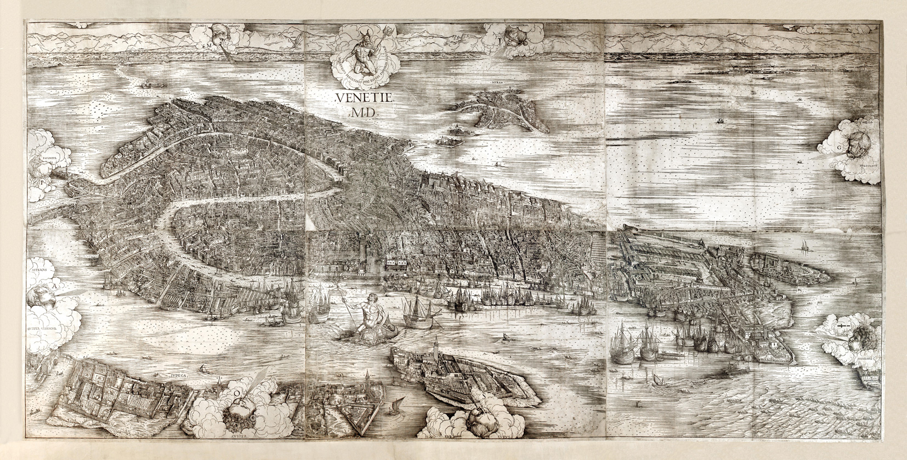

# Gardens in 16th-18th-century Venice

r p r

Here you can explore a famous view of Venice, a woodcut by the painter and engraver Jacopo de' Barbari, describing the city in minute detail at the height of the year 1500 [more info](https://www.movio.beniculturali.it/bnm/ridottiprocuratorisanmarco/it/34/la-veduta-di-venezia). The woodcut is a sum of highly accurate urban views taken from several angles, but organised to simulate a single point of view.

If you click on one of the red triangles, you will enlarge the section/portion of de Barbari’s map where the existence of a fairly large garden is documented. Most of them no longer exist today, but, particularly from the dawn of the 16th century, private gardens multiplied and were very numerous until the fall of the Venetian Republic (1797). Although Venice was not an ideal place to grow plants, because of the salinity of the soil, Venetians did their best to build rainwater wells with underground cisterns for irrigation. Surrounded by high walls and hidden from prying eyes—many foreigners passing through Venice were totally unaware of their existence—gardens were adorned with fountains, small buildings, statues and they were often the setting for parties and receptions featuring song and dance.

The term *giardino* was used with rather indefinite and overlapping meanings: to indicate a garden proper, a vegetable garden, an orchard, and even a field. Many gardens belonged to owners with a passion for botany, who enriched them with plants from all over the known world to enjoy their exotic beauty and study their medicinal properties.

r p r

## Learn More
* John Dixon Hunt, “The Garden in the City of Venice: Epitome of a State and Site”, *Studies in the History of Gardens & Designed Landscapes*, 19:1 (1999), 46-61, DOI: 10.1080/14601176.1999.10435570.

* Maria Francesca Tiepolo, “Fonti documentarie sui giardini nell'Archivio di Stato di Venezia fino al 1797”, in *Il giardino veneto. Storia e conservazione*, a cura di Margherita Azzi Visentini, Italo Zannier, Rosario Assunto (Venezia: Istituto Veneto di Scienze, Lettere ed Arti, 1988), 331–338, and, in general, the whole publication.
